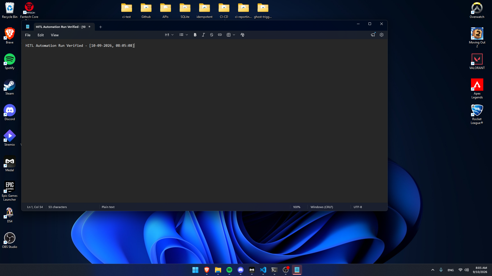

# The Ghost Desktop Trigger: HITL CI/CD Architecture

A Hardware-in-the-Loop (HITL) CI/CD architecture bridging cloud environments with physical desktop hardware. This pipeline utilizes self-hosted GitHub Actions runners to trigger, monitor, and extract artifacts from local Windows GUI automation sessions.

## 🚀 The Architecture

Standard cloud-hosted runners (like `ubuntu-latest` or `windows-latest`) execute in headless environments. On Windows, background services operate in **Session 0 Isolation**, meaning they have no graphical rendering context. This makes native GUI automation, computer vision UI testing, and physical hardware benchmarking impossible in standard CI/CD pipelines.

This repository solves that by deploying a custom self-hosted runner configured for interactive desktop sessions, orchestrated by a highly deterministic Python process manager.

### Execution Flow
1. **Cloud Trigger:** A `push` or `workflow_dispatch` event fires in GitHub.
2. **Hardware Routing:** The job is routed specifically to the `[self-hosted, hitl-windows]` physical node.
3. **Pre-flight Idempotency:** The local Python agent scans the OS for zombie processes of the target application and forcefully terminates them to guarantee a clean state.
4. **Interactive Execution:** The application is launched and foregrounded (bypassing Windows 11 UWP stub limitations via dynamic PID-to-HWND mapping).
5. **Automation & Verification:** Synthetic inputs are dispatched via PyAutoGUI, and the final physical screen state is captured.
6. **Post-flight Teardown:** The environment is wiped clean.
7. **Artifact Extraction:** The physical screenshot is uploaded back to the GitHub Cloud UI.

## 🛠️ Core Technologies
* **CI/CD:** GitHub Actions (Self-Hosted Runner Architecture)
* **Automation Engine:** Python 3.11, PyAutoGUI, Pillow
* **Process & State Management:** `psutil`, `win32gui`, `win32process` (Win32 API)

## 🧠 Engineering Highlights

* **Absolute Idempotency:** GUI automation is inherently fragile. The custom `ProcessManager` guarantees that previous crashed pipeline runs do not leave lingering window instances that would corrupt the current test.
* **Windows 11 UWP Stub Bypass:** Modern Windows executables (like `notepad.exe`) launch as lightweight stubs before handing execution to a UWP app, instantly changing their PID. The engine maps live PIDs dynamically to capture the correct Window Handle (HWND) for reliable focus management.
* **Foreground Lock Timeout Mitigation:** Utilizes `WScript.Shell` fallbacks to forcefully bring applications to the foreground when the OS attempts to block automated focus stealing.

## 📸 Proof of Execution

*The image below is automatically generated on physical hardware and extracted to the cloud upon a successful pipeline run.*

